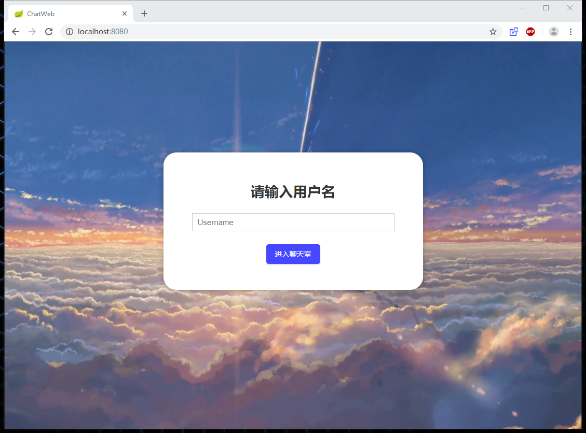
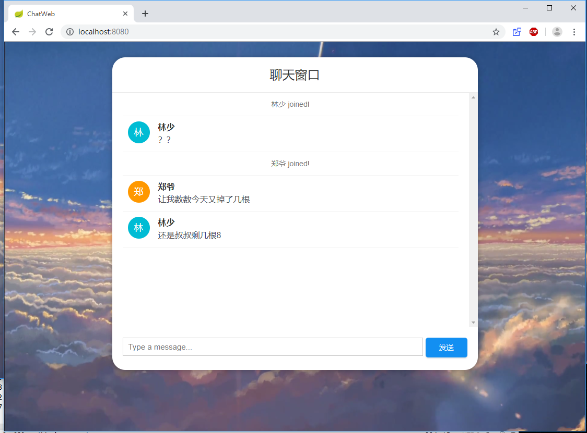

# ChatRoom-Springboot-WebSocket
主要参考的大腿博文：[WebSocket多人在线聊天室](https://blog.csdn.net/qqxx6661/article/details/98883166)

通过Springboot+WebSocket实现一个Web聊天室功能

现在暂时只能在一台服务器（中的一个端口即8080）进行聊天室功能。

输入用户名，聊天室窗口先隐藏，除输入用户名后进才会显示

聊天示例：

